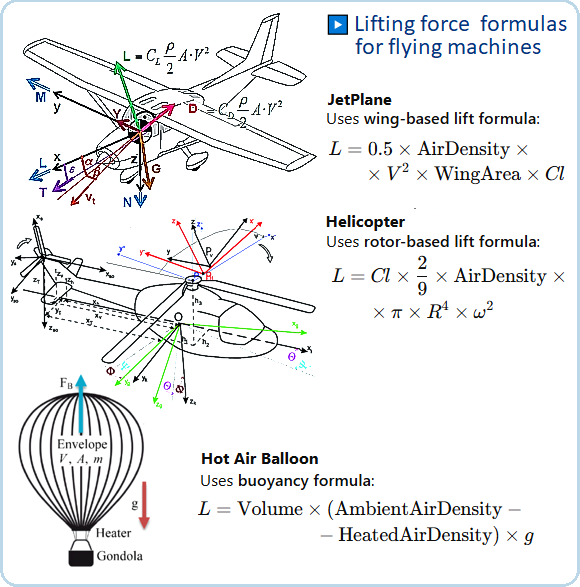

# LINQ Query Syntax

.NET9 C# application: **LINQ-Query**  and modern techniques to C# 11.

## Description

This "LINQ-Query" program is written in C# .NET 9 which allows you to use C# 12 language syntax.
Here the program mainly demonstrates "LINQ Query Syntax" techniques, in another example 
<a href="https://github.com/janluksoft/NET_LinqMethod">LINQ Method Syntax</a> techniques are presented.

The **Linq-Query** program is a C# demonstration project that illustrates how to use SQL-like 
LINQ query syntax combined with pattern matching to process a collection of objects. 
The application features three types of flying machines—**JetPlane**, **Helicopter**, 
and **HotAirBalloon**—which all inherit from the abstract base class **FlyingMachine**. 
This design allows uniform processing of diverse objects while still supporting type-specific 
behavior.



## Project Structure

The project is divided into four source files:

- **Program.cs**  
  Contains the `Main` method, which creates an instance of `CMainFly` and starts the flying machines demonstration.

- **Fly.cs**  
  Defines the `CMainFly` class that coordinates the demonstration. It retrieves a list of flying machines from the `CExampleMachines` class and displays their details in several ways:
  - **PrintPureList:** Iterates over the collection and prints each machine’s details.
  - **PrintViaPatternMatching:** Uses C# pattern matching (switch expressions) to handle type-specific actions.
  - **PrintViaLinqQuery:** Uses LINQ query syntax with a switch expression to map each machine to its corresponding formatted output.
  - **PrintViaLinqQuery2:** Demonstrates additional LINQ operations:
    - **Filtering** by lift force.
    - **Ordering** by weight.
    - **Grouping** by machine kind.
    - **Projection** to select specific fields.
    - **Aggregation** to calculate the total lift.

- **FlyMachines.cs**  
  Contains the class hierarchy for flying machines:
  - **FlyingMachine (abstract):** Defines common properties (like Name, Weight, Kind) and methods (e.g., `CalculateLift`, `FlyingMessage`).
  - **JetPlane, Helicopter, HotAirBalloon:** Derived classes that implement type-specific methods to calculate lift and display formatted messages.
  - **CExampleMachines:** Provides a sample list of flying machines with hardcoded values and uses indexers for accessories such as jet engines and balloon baskets.

- **FlyAccessories.cs**  
  Contains accessory-related classes and records:
  - **CBaskets:** Manages hot air balloon baskets using indexers.
  - **CJetEngines:** Manages jet engine information using indexers.
  - Additional records and the `IPrintJ` interface support formatting and displaying accessory details.

## Key Features

### Object-Oriented Design

- **Inheritance & Polymorphism:**  
  All flying machine types inherit from the common abstract class, allowing them to be processed as a single collection while each type implements its own behavior (e.g., calculating lift).

- **Encapsulation:**  
  Each class handles its own logic. For example, each derived class calculates lift and formats messages independently, while accessory classes encapsulate engine and basket details.

### LINQ Query Demonstrations

The program showcases the power of LINQ in two main parts:

1. **SQL-like LINQ Query with Pattern Matching:**  
   In the `PrintViaLinqQuery` method, a LINQ query uses a switch expression to determine the correct formatted output for each flying machine type. This approach leverages pattern matching to call methods like `Jet_message`, `FlyingMessage`, or `Balloon_message` based on the machine type.

2. **Advanced LINQ Operations:**  
   The `PrintViaLinqQuery2` method extends the demonstration with:
   - **Filtering:** Selecting machines whose calculated lift exceeds a given threshold.
   - **Ordering:** Sorting machines by weight in descending order.
   - **Grouping:** Grouping machines by their kind (e.g., "jet", "heli", "balloon") and displaying counts.
   - **Projection:** Creating summaries that include only selected fields (name, kind, and lift).
   - **Aggregation:** Calculating the total lift generated by all machines in the collection.

### Console Output

The console output is formatted into clear sections that correspond to each method:
- A header introducing the demonstration.
- A list of all flying machines with their calculated parameters.
- Detailed outputs for pattern matching and LINQ queries.
- Results for additional LINQ examples, including filtering, ordering, grouping, projection, and the aggregated total lift.

An excerpt from the output shows:
- Detailed parameters for each type (JetPlanes, Helicopters, HotAirBalloons).
- Results from the LINQ queries, including filtering (lift force above 50,000 kg), ordering by weight, grouping by kind, projection of specific fields, and the total lift.

<b>Console Output</b>

```
Hello, Aircrafts! Demonstration of SQL-like LINQ-QUERY queries

Below are the parameters of several FlyingMachines and their calculated lift:

List of JetPlanes:
    JetPlane     Airbus A318        mass:  67 000,0 kg  lift force:  77 026,3 kG
    JetPlane     Airbus A320        mass:  78 000,0 kg  lift force:  77 879,4 kG
    JetPlane     Airbus A380-800    mass: 560 000,0 kg  lift force: 584 319,0 kG
    JetPlane     Boeing 737-800     mass:  79 000,0 kg  lift force:  79 149,8 kG
    JetPlane     Boeing 747-400     mass: 412 000,0 kg  lift force: 428 595,2 kG

List of Helicopters:
    Heli ground  UH-60 Black Hawk   mass:  10 660,0 kg  lift force:  19 032,5 kG
    Heli ground  Eurocopter EC135   mass:   2 980,0 kg  lift force:   5 194,3 kG
    Heli ground  Aitbus H135        mass:   3 100,0 kg  lift force:   5 444,5 kG
    Heli ground  Leonardo AW101     mass:  15 600,0 kg  lift force:  26 494,3 kG

List of HotAirBalloons:
    Balloon      Cameron Z-750      mass:   3 640,0 kg  lift force:   6 371,4 kG
    Balloon      Ultramagic N-425   mass:   1 930,0 kg  lift force:   3 630,0 kG
    Balloon      Cameron Z-160      mass:     650,0 kg  lift force:   1 359,3 kG
    Balloon      Kubicek BB70-Z     mass:   1 230,0 kg  lift force:   2 100,0 kG
    Balloon      Schroeder G24      mass:     340,0 kg  lift force:     660,0 kG
    Balloon      Kubicek BB34Z      mass:     475,0 kg  lift force:   1 020,0 kG

Start print via Pattern Matching
    JetPlane     Airbus A318        mass:  67 000,0 kg  lift force:  77 026,3 kG
                                2 X JetEngine: CFM56-5A5 , Thrust: 105000 N

    JetPlane     Airbus A320        mass:  78 000,0 kg  lift force:  77 879,4 kG
                                2 X JetEngine: CFM56-5A1 , Thrust: 110000 N

    JetPlane     Airbus A380-800    mass: 560 000,0 kg  lift force: 584 319,0 kG
                                4 X JetEngine: TRENT-900 , Thrust: 356000 N

    Balloon      Schroeder G24      mass:     340,0 kg  lift force:     660,0 kG
                    Basket Name: Schr-II , Material: Wicker , Weight:   86,2 kg.

    Balloon      Kubicek BB34Z      mass:     475,0 kg  lift force:   1 020,0 kG
                    Basket Name: Kub-K18 , Material: Wicker , Weight:   85,1 kg.


Start print via LinqQuery
FlyingMachines.JetPlane -     JetPlane     Airbus A318        mass:  67 000,0 kg  lift force:  77 026,3 kG
                                2 X JetEngine: CFM56-5A5 , Thrust: 105000 N

FlyingMachines.JetPlane -     JetPlane     Airbus A320        mass:  78 000,0 kg  lift force:  77 879,4 kG
                                2 X JetEngine: CFM56-5A1 , Thrust: 110000 N

FlyingMachines.JetPlane -     JetPlane     Airbus A380-800    mass: 560 000,0 kg  lift force: 584 319,0 kG
                                4 X JetEngine: TRENT-900 , Thrust: 356000 N

FlyingMachines.JetPlane -     JetPlane     Boeing 737-800     mass:  79 000,0 kg  lift force:  79 149,8 kG
                                2 X JetEngine: CFM56-7B27, Thrust: 121000 N

FlyingMachines.JetPlane -     JetPlane     Boeing 747-400     mass: 412 000,0 kg  lift force: 428 595,2 kG
                                4 X JetEngine: GEnx-2B   , Thrust: 320000 N

FlyingMachines.Helicopter -     Heli ground  UH-60 Black Hawk   mass:  10 660,0 kg  lift force:  19 032,5 kG

FlyingMachines.Helicopter -     Heli ground  Eurocopter EC135   mass:   2 980,0 kg  lift force:   5 194,3 kG

FlyingMachines.Helicopter -     Heli ground  Aitbus H135        mass:   3 100,0 kg  lift force:   5 444,5 kG

FlyingMachines.Helicopter -     Heli ground  Leonardo AW101     mass:  15 600,0 kg  lift force:  26 494,3 kG

FlyingMachines.HotAirBalloon -     Balloon      Cameron Z-750      mass:   3 640,0 kg  lift force:   6 371,4 kG
                                    Basket Name: Dry-14  , Material: Alu    , Weight:  302,4 kg.

FlyingMachines.HotAirBalloon -     Balloon      Ultramagic N-425   mass:   1 930,0 kg  lift force:   3 630,0 kG
                                    Basket Name: Bas-N12 , Material: Wicker , Weight:  221,4 kg.

FlyingMachines.HotAirBalloon -     Balloon      Cameron Z-160      mass:     650,0 kg  lift force:   1 359,3 kG
                                    Basket Name: Bas-N05 , Material: Wicker , Weight:  102,2 kg.

FlyingMachines.HotAirBalloon -     Balloon      Kubicek BB70-Z     mass:   1 230,0 kg  lift force:   2 100,0 kG
                                    Basket Name: Bas-N08 , Material: Wicker , Weight:  145,2 kg.

FlyingMachines.HotAirBalloon -     Balloon      Schroeder G24      mass:     340,0 kg  lift force:     660,0 kG
                                    Basket Name: Schr-II , Material: Wicker , Weight:   86,2 kg.

FlyingMachines.HotAirBalloon -     Balloon      Kubicek BB34Z      mass:     475,0 kg  lift force:   1 020,0 kG
                                    Basket Name: Kub-K18 , Material: Wicker , Weight:   85,1 kg.


1) Filtering by Lift Force > 50000 Kg
  Machine: Airbus A318       , lift force:    77 026,3 kG
  Machine: Airbus A320       , lift force:    77 879,4 kG
  Machine: Airbus A380-800   , lift force:   584 319,0 kG
  Machine: Boeing 737-800    , lift force:    79 149,8 kG
  Machine: Boeing 747-400    , lift force:   428 595,2 kG

2) Ordering Machines by Weight
  Machine: Airbus A380-800   , Weight: 560 000,0 kg, Lift:  584 319 kg
  Machine: Boeing 747-400    , Weight: 412 000,0 kg, Lift:  428 595 kg
  Machine: Boeing 737-800    , Weight:  79 000,0 kg, Lift:   79 150 kg
  Machine: Airbus A320       , Weight:  78 000,0 kg, Lift:   77 879 kg
  Machine: Airbus A318       , Weight:  67 000,0 kg, Lift:   77 026 kg
  Machine: Leonardo AW101    , Weight:  15 600,0 kg, Lift:   26 494 kg
  Machine: UH-60 Black Hawk  , Weight:  10 660,0 kg, Lift:   19 033 kg
  Machine: Cameron Z-750     , Weight:   3 640,0 kg, Lift:    6 371 kg
  Machine: Aitbus H135       , Weight:   3 100,0 kg, Lift:    5 444 kg
  Machine: Eurocopter EC135  , Weight:   2 980,0 kg, Lift:    5 194 kg
  Machine: Ultramagic N-425  , Weight:   1 930,0 kg, Lift:    3 630 kg
  Machine: Kubicek BB70-Z    , Weight:   1 230,0 kg, Lift:    2 100 kg
  Machine: Cameron Z-160     , Weight:     650,0 kg, Lift:    1 359 kg
  Machine: Kubicek BB34Z     , Weight:     475,0 kg, Lift:    1 020 kg
  Machine: Schroeder G24     , Weight:     340,0 kg, Lift:      660 kg

3) Grouping Machines by Kind

Type: jet, Count: 5
    Airbus A318
    Airbus A320
    Airbus A380-800
    Boeing 737-800
    Boeing 747-400

Type: heli, Count: 4
    UH-60 Black Hawk
    Eurocopter EC135
    Aitbus H135
    Leonardo AW101

Type: balloon, Count: 6
    Cameron Z-750
    Ultramagic N-425
    Cameron Z-160
    Kubicek BB70-Z
    Schroeder G24
    Kubicek BB34Z

4) Projection (Selecting Specific Fields)
    Machine: Airbus A318         jet      - Lift:    77 026,3 kG
    Machine: Airbus A320         jet      - Lift:    77 879,4 kG
    Machine: Airbus A380-800     jet      - Lift:   584 319,0 kG
    Machine: Boeing 737-800      jet      - Lift:    79 149,8 kG
    Machine: Boeing 747-400      jet      - Lift:   428 595,2 kG
    Machine: UH-60 Black Hawk    heli     - Lift:    19 032,5 kG
    Machine: Eurocopter EC135    heli     - Lift:     5 194,3 kG
    Machine: Aitbus H135         heli     - Lift:     5 444,5 kG
    Machine: Leonardo AW101      heli     - Lift:    26 494,3 kG
    Machine: Cameron Z-750       balloon  - Lift:     6 371,4 kG
    Machine: Ultramagic N-425    balloon  - Lift:     3 630,0 kG
    Machine: Cameron Z-160       balloon  - Lift:     1 359,3 kG
    Machine: Kubicek BB70-Z      balloon  - Lift:     2 100,0 kG
    Machine: Schroeder G24       balloon  - Lift:       660,0 kG
    Machine: Kubicek BB34Z       balloon  - Lift:     1 020,0 kG

                                   5) Total Lift: 1 318 276,1 kG
---- The End -----------
```

## Conclusion

The **Linq-queries** program is an excellent demonstration of combining modern 
C# features—such as pattern matching, LINQ query syntax, and object-oriented 
design—to process and display a heterogeneous collection. It not only teaches 
the basics of LINQ but also delves into advanced operations like grouping and 
aggregation. This project is a valuable resource for both beginners and 
intermediate programmers seeking to understand the versatility of LINQ in 
a practical context.
